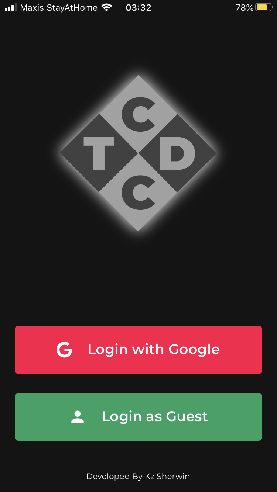
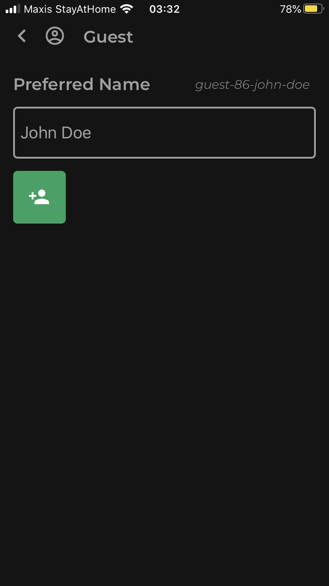
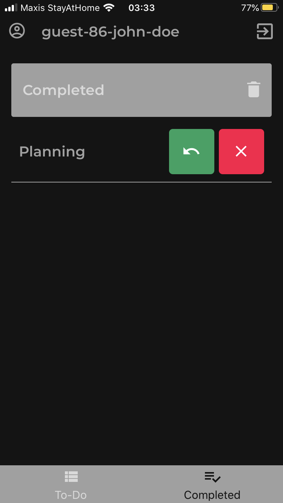
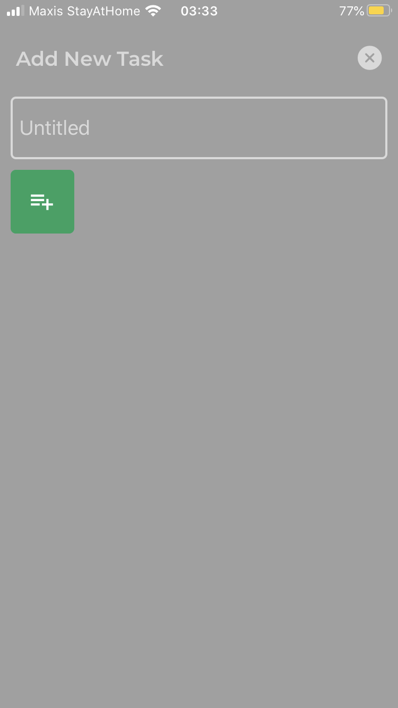
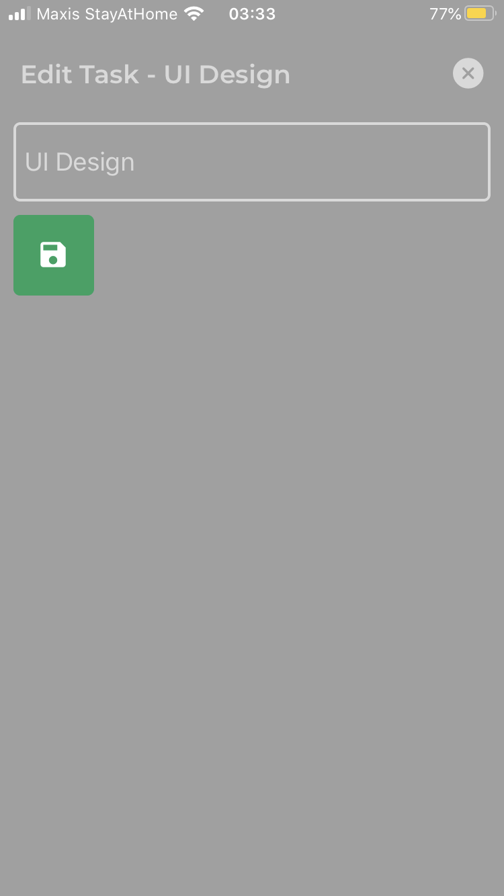
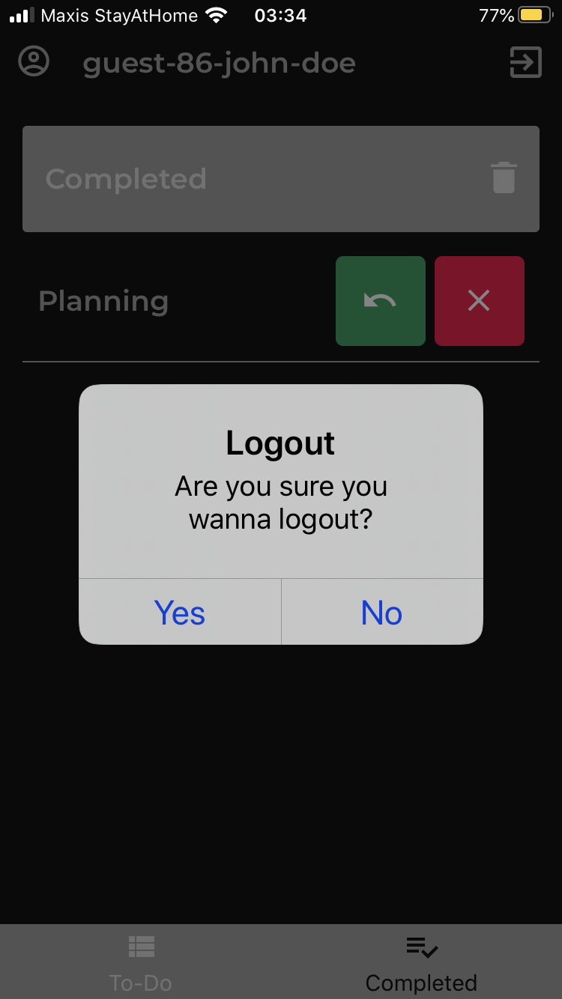
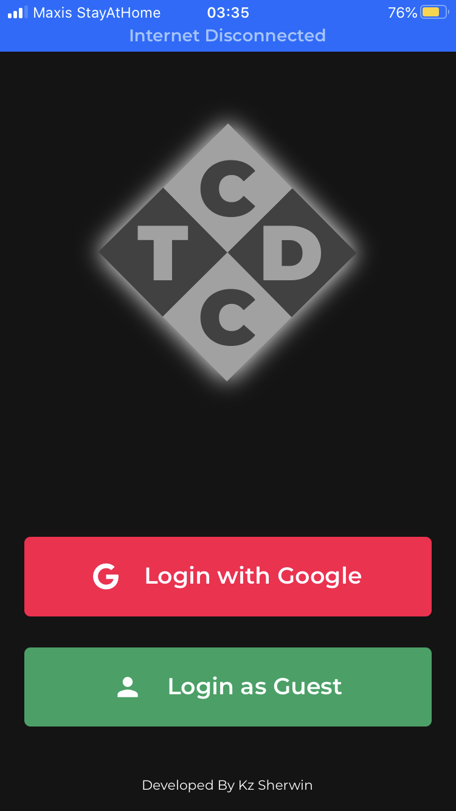

# Collaborative To-Do App With Concurrency Control
TDCC is a classic collaborative to-do mobile application built using `React Native` and `Firebase`.

# Prerequisites
- Supported Platforms: iOS and Android (Website excluded)
- Expo Client App needed to be installed
- Internet connection required

# Features
- Login with Google OAuth or as a Guest
- Logout
- Add New To-Do Task
- Edit To-Do Task Title
- Delete To-Do/Completed Task
- Mark To-Do Task As Completed
- Revert Completed Task Back To To-Do Task
- Clear All To-Do Tasks (Excluding Locked Ones)
- Concurrent Update Prevention
- Real-Time Updates

# Installation & Setup
#### Step 1
Install Expo Client App via Google Play Store (for Android) or App Store (for iOS)

#### Step 2
Clone this GitHub repository

#### Step 3
Install all node modules require by issuing:
```bash
expo install
```

### Step 4
Create a file for Firebase web app's configuration named `config/firebase.js`. You will need to create an account and a project via Firebase website. After that, copy the firebase web app's configuration from your firebase web sdk snippet. It should look like this:

```js
module.exports = {
    apiKey: YOUR-API-KEY,
    authDomain: YOUR-AUTH-DOMAIN,
    databaseURL: YOUR-DATABASE-URL,
    projectId: YOUR-PROJECT-ID,
    storageBucket: YOUR-STORAGE-BUCKET,
    messagingSenderId: YOUR-MESSAGING-SENDER-ID,
    appId: YOUR-APP-ID
};
```

### Step 5
Create a file for Google OAuth Client ID named `config/google-oauth-client.js`. You will need to create client id through Google Developer. After that, copy the ids for iOS and Android to this file. It should look like this:

```js
module.exports = {
    ios: {
        id: GOOGLE-IOS-CLIENT-ID
    },
    android: {
        id: GOOGLE-ANDROID-CLIENT-ID
    }
}
```

### Step 6
Start Expo Metro Server by issuing:
```bash
expo start
```

### Step 7
Open TDCC App through Expo Client App by scanning the QR-Code (iOS using Camera/Android using Scanner provided by Expo Client App) shown in the popup page/terminal

# Showcase Images
<kbd>
  
  
  
  
  
  
  
  
</kbd>

# Got Question?
> kzsherdev@gmail.com
