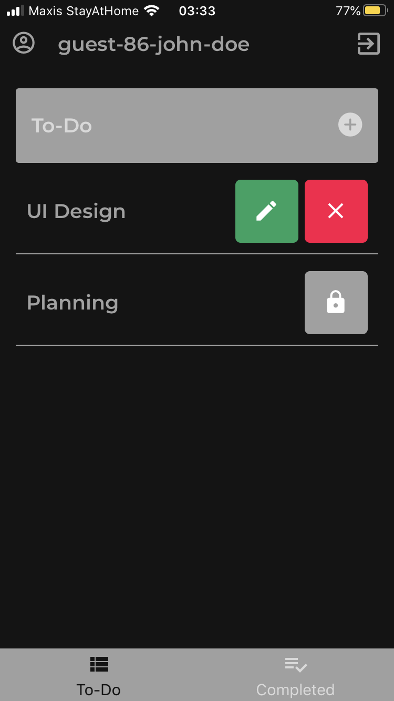

# Collaborative To-Do App With Concurrency Control
TDCC is a classic collaborative to-do mobile application built using `React Native` and `Firebase`.

# Prerequisites
- Supported Platforms: iOS and Android (Website excluded)
- Expo Client App needed to be installed
- Internet connection required

# Features
- Login with Google OAuth or as a Guest
- Logout
- Add New To-Do Task
- Edit To-Do Task Title
- Delete To-Do/Completed Task
- Mark To-Do Task As Completed
- Revert Completed Task Back To To-Do Task
- Clear All To-Do Tasks (Excluding Locked Ones)
- Concurrent Update Prevention
- Real-Time Updates

# Installation & Setup
#### Step 1
Install Expo Client App via Google Play Store (for Android) or App Store (for iOS)

#### Step 2
Clone this GitHub repository

#### Step 3
Install all node modules require by issuing:
```bash
expo install
```

### Step 4
Start Expo Metro Server by issuing:
```bash
expo start
```

### Step 5
Open TDCC App through Expo Client App by scanning the QR-Code (iOS using Camera/Android using Scanner provided by Expo Client App) shown in the popup page/terminal

# Showcase Images
<kbd>
  
  
  
  
  
  
  
  
</kbd>

# Got Question?
> kzsherdev@gmail.com
